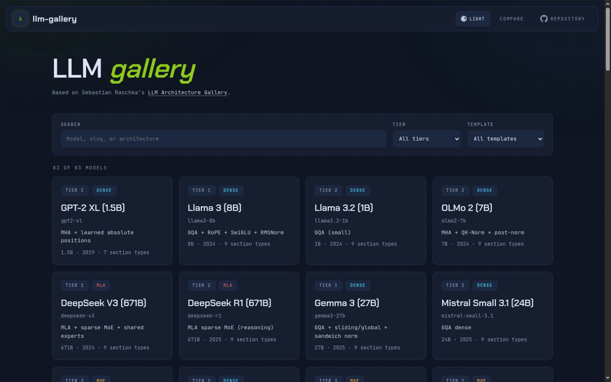
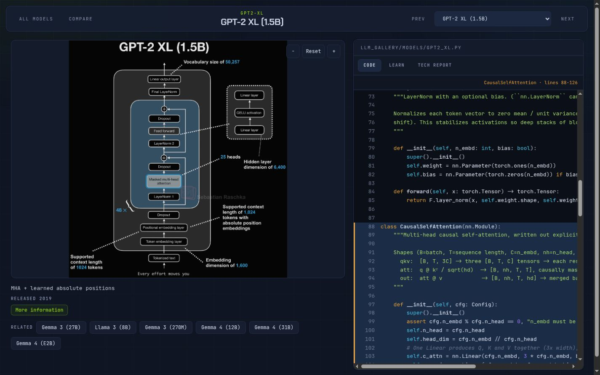
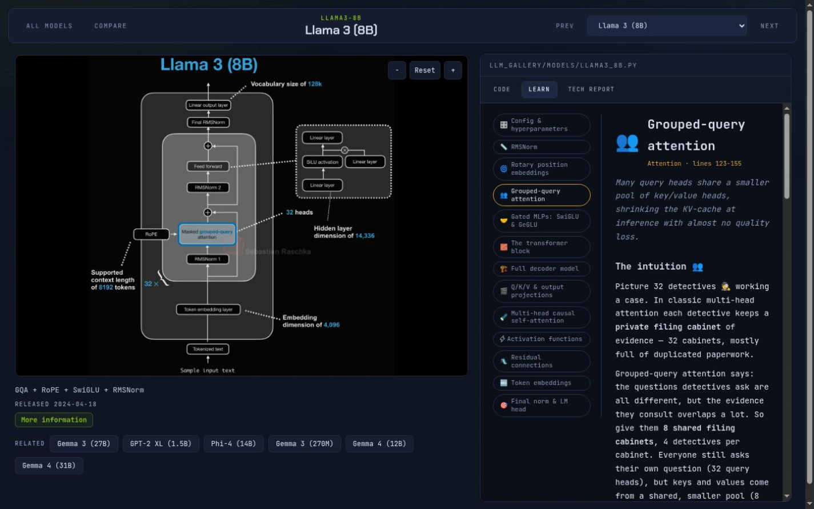

# llm-gallery

Readable, runnable implementations of every model in Sebastian Raschka's
[LLM Architecture Gallery](https://sebastianraschka.com/llm-architecture-gallery).

Explore the architectures in the [interactive visualizer](https://pavelsimo.github.io/llm-gallery/),
or run them locally to inspect shapes, parameter counts, forward and backward passes, and tiny training runs.



## From diagram to code

Each architecture is paired with its self-contained Python implementation. Select a block in the diagram
to jump to the matching code, or select a line of code to find the corresponding part of the model.





## Quickstart

```bash
# Install dependencies
uv sync

# Browse the available models
uv run python -m llm_gallery.cli list

# Build a tiny model and run a forward + backward pass
uv run python -m llm_gallery.cli smoke gpt2-xl

# Train the tiny preset on tiny Shakespeare
uv run python -m llm_gallery.cli train gpt2-xl --preset tiny --steps 500

# Run the test suite
uv run pytest
```

To serve the visualizer locally:

```bash
uv run python scripts/build_visualizer_data.py
python -m http.server 8000 --directory web
```

## How the models are organized

Every file in `llm_gallery/models/` defines one complete architecture from top to bottom. Building blocks
are intentionally kept in the model file so the implementation can be read without chasing abstractions.

The `tiny` presets are small enough for tests and learning runs. The `real` presets preserve published model
dimensions for reference. Models are randomly initialized: the project has no Hugging Face dependency and
does not download pretrained weights.

For the architectural family tree and key concepts, see
[`docs/architectures.md`](docs/architectures.md).
